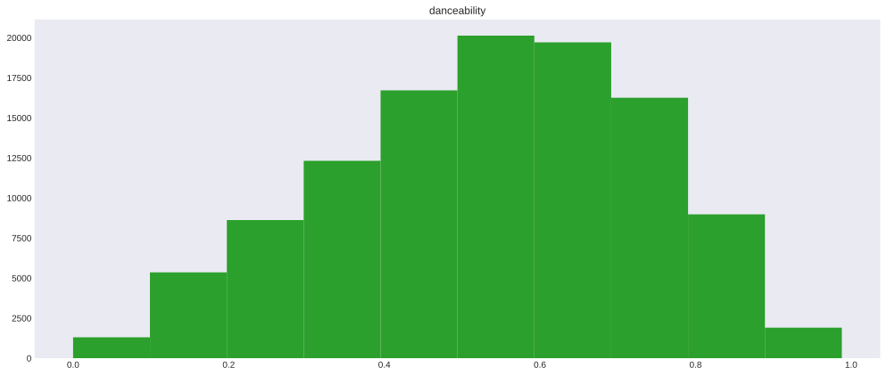

```python
import random
import numpy as np
import pandas as pd
import matplotlib.pyplot as plt
import matplotlib.colors as colors

from keys import ID, SECRET

bucket = 'spotifyrecsystem'

plt.rcParams["figure.figsize"] = (17, 7)
plt.style.use('seaborn-dark')
```


```python
client = boto3.client(
    's3',
    aws_access_key_id = ID, 
    aws_secret_access_key = SECRET,
    region_name = 'us-west-1'
)

resource = boto3.resource(
    's3',
    aws_access_key_id = ID, 
    aws_secret_access_key = SECRET,
    region_name = 'us-west-1'
)
```


```python
dat = pd.read_csv('audio_features_full/features_full.csv')
```


```python
dtypes_list = [dtype_vals[1].values for dtype_vals in dat.dtypes.reset_index().items()]

dtypes_dict = dict(zip(dtypes_list[0], [dtype_name.name for dtype_name in dtypes_list[1]]))
```


```python
for ind, col in enumerate(dat.columns):
    if dtypes_dict[col] == 'float64':
        plt.figure()
        plt.hist(
            dat[col], 
            color=random.choice(list(colors.TABLEAU_COLORS.values()))
        )
        plt.title(col)
```


    

    


    

    


    

    


    

    


    

    


    

    


    

    


    

    


    

    


```python
plt.hist(
    pd.to_datetime(dat['release_date']),
    color=random.choice(list(colors.TABLEAU_COLORS.values()))
)
plt.title('Release Date')
plt.plot()
```


    []


    

    


```python
plt.bar(
    list(map(str, dat['mode'].unique().tolist()))[::-1],
    dat['mode'].value_counts().values.tolist()[::-1],
    color=random.choice(list(colors.TABLEAU_COLORS.values()))
)
plt.title('Mode')
plt.plot() 
```


    []


    

    


```python
plt.hist(
    dat['key'],
    color=random.choice(list(colors.TABLEAU_COLORS.values()))
)
plt.title('Key')
plt.plot()
```


    []


    

    


```python
plt.hist(
    dat['duration_ms'],
    color=random.choice(list(colors.TABLEAU_COLORS.values()))
)
plt.title('Duration (Milliseconds)')
plt.plot()
```


    []


    

    


```python
plt.hist(
    dat['time_signature'],
    color=random.choice(list(colors.TABLEAU_COLORS.values()))
)
plt.title('Time Signature')
plt.plot()
```


    []


    

    


```python

```
